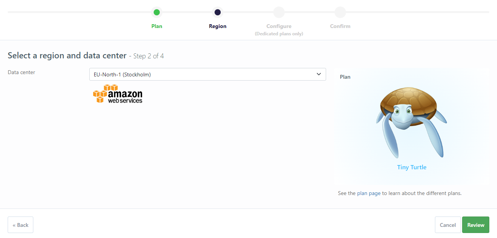
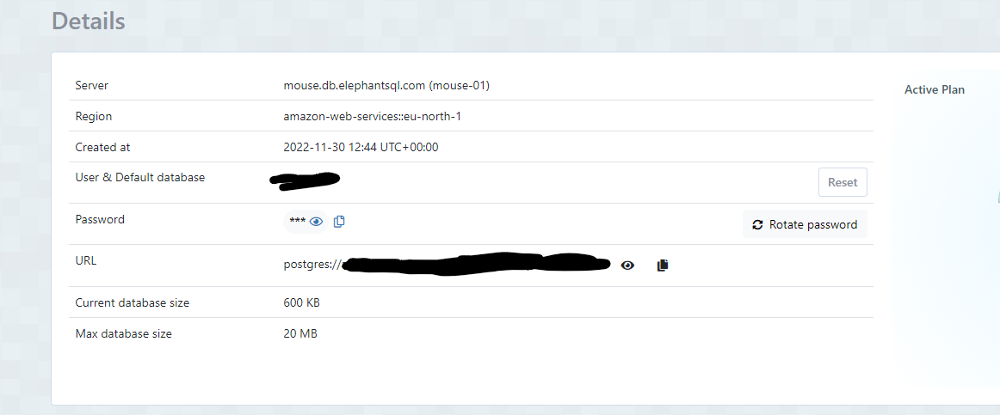
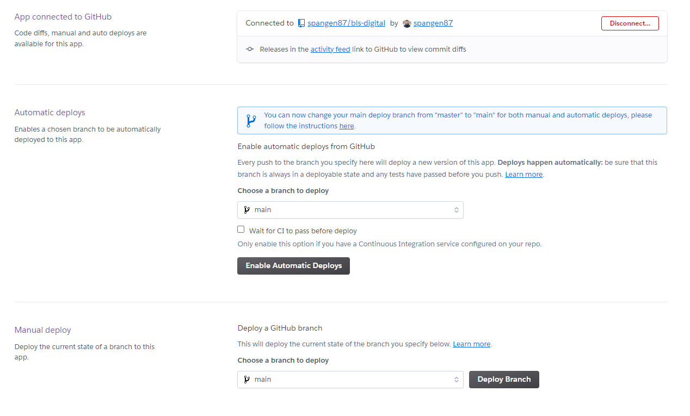

# BLS Digital


Welcome to [BLS Digital](#)!


## Contents
- [User Experience](#user-experience)
    - [User Stories](#user-stories)
    - [Agile Methodology](#agile-methodology)
    - [Wireframes/Flowchart](#wireframesflowchart)
    - [Design](#design)
- [Features](#features)
    - [Existing Features](#existing-features) 
    - [Future Features](#future-features)
- [Tecnologies Used](#technologies-used)
    - [Technologies Used](#technologies-used)
    - [Libraries](#libraries)
- [Testing](#testing)
- [Bugs](#bugs)
    - [Solved](#solved)
    - [Left to Solve](#left-to-solve)
- [Deployment](#deployment)
    - [Deployment to Heroku](#deployment-to-heroku)
    - [Forking The Repository On GitHub](#forking-the-repository-on-github)
    - [How To Clone The Project](#how-to-clone-the-project)
- [Credits](#credits)
- [Acknowledgements](#acknowledgements)


## User Experience
### User Stories
#### Site User

#### Staff Member


[Back to top](#contents)
### Agile Methodology
#### GitHub Project Board


[Back to top](#contents)
### Wireframes


### Database


### Design
#### Typography


#### Colors


[Back to top](#contents)
## Features
### Existing Features For All Users
#### Navigation Bar


[Back to top](#contents)
#### Home


[Back to top](#contents)
#### About


[Back to top](#contents)
#### Footer


[Back to top](#contents)
#### Login Page


[Back to top](#contents)
#### Sign Up Page


[Back to top](#contents)
#### Custom 404 Page


[Back to top](#contents)
### Existing Features For Store Owners
#### Add, delete and edit products


[Back to top](#contents)
#### Mark Order As Shipped


[Back to top](#contents)
#### All Reviews


[Back to top](#contents)
### Future Features
- Add discount cuopons would be a nice feature to have in the future.
-


[Back to top](#contents)
## Technologies Used
- [Django](https://www.djangoproject.com/) - A model-view-template framework used to create Locksmith Booking
- [Bootstrap](https://getbootstrap.com/) - A CSS framework used for the front end development.
- [HTML5](https://en.wikipedia.org/wiki/HTML) - Provides the content and structure for the website.
- [CSS3](https://en.wikipedia.org/wiki/CSS) - Provides the styling for the website.
- [JavaScript](https://en.wikipedia.org/wiki/JavaScript) - Provides interactive elements of the website
- [Python](https://en.wikipedia.org/wiki/Python_(programming_language)) - Provides the functionality of the website.
- [a11y](https://color.a11y.com/Contrast/) - Used to test the contrast and accessibility.
- [Gitpod](https://gitpod.io/) - Used to create and edit the website.
- [GitHub](https://github.com/) - Used to host the repository.
- [GitBash](https://en.wikipedia.org/wiki/Bash_(Unix_shell)) - Terminal used to push changes to the GitHub repository.
- [Google Chrome DevTools](https://developer.chrome.com/docs/devtools/) - Used to test responsiveness and debug.
- [Balsamiq](https://balsamiq.com/) - Used to create the wireframes for the project.
- [Cloudinary](https://cloudinary.com/) - Used to host all static files and images.
- [Heroku](https://dashboard.heroku.com) - Used to deploy the website.
- [PEP8 Validation](http://pep8online.com/) - Used to validate Python code.
- [HTML Validation](https://validator.w3.org/) - Used to validate HTML code.
- [CSS Validation](https://jigsaw.w3.org/css-validator/) - Used to validate CSS code.
- [JSHint Validation](https://jshint.com/) - Used to validate JavaScript code.
- [drawSQL](https://drawsql.app/) - Used to draw the database schema.

[Back to top](#contents)
### Libraries
The following libraries are used in the project and are located in the requirements.txt file.


[Back to top](#contents)
## Testing
### Validator Testing
Locksmith Booking have been tested by using validation tools for HTML, CSS, JavaScript and Python.
- [W3C HTML Validator](https://validator.w3.org/)
- [W3C CSS Validator](https://jigsaw.w3.org/css-validator/)
- [JSHint JavaScript Validator](https://jshint.com/)

#### HTML Validation


#### CSS Validation


#### JavaScript Validation


#### Python Validation


[Back to top](#contents)
### Lighthouse Testing
The application has been tested with Chrome Dev Tools Lighthouse Testing which tests the application for:
- Performance
- Accessibility
- Best Practices
- SEO 

#### Home page


#### About Page


[Back to top](#contents)
### Accessibility Testing
I checked so the contrast was enough on the site using [a11y](https://color.a11y.com/Contrast/).


[Back to top](#contents)
### Responsiveness Testing
Test for responsiveness was made with [Google Chrome DevTools](https://developer.chrome.com/docs/devtools/).

[Back to top](#contents)
### Browser Testing


[Back to top](#contents)
### Manual testing


[Back to top](#contents)
## Bugs
### Solved
- When clicking on a category link under products, the products in that category won't show.
I solved this one by adding a split by "," to the category in the views.

- When sorting by name it throws an error saying that Lower is not defined.

[Back to top](#contents)
### Left to Solve
- When clicking on a category link under products, the products in that category won't show.
- When sorting by name it throws an error saying that Lower is not defined.
- Submitting checkout form without country code on the phone number throws an error instead of a message.
- Delivery costs become 34$ instead of 5$ after checkout.

[Back to top](#contents)
## Deployment
### Deployment to Heroku
This application is deployed using [Heroku](https://heroku.com/).

- Before doing the following steps I created a env.py file in gitpod that contains the sensitive information that should not be pushed to github/heroku. And added that file to the .gitignore file.
- Created a Procfile so Heroku knows what kind of application it is.
- Created a requirements.txt file with all the necessary requirements for the app to run.

The steps for deploying through [Heroku](https://heroku.com/) is as follows:

1. Visit [Heroku](https://heroku.com/) and make sure you are logged in.
2. Click on New and then choose New App.
3. Choose a name for your app and then choose your region.
4. Then press 'Create app'.

#### Attach The Database
1. Log in or sign up to [ElephantSQL](https://www.elephantsql.com/).
2. Press create new instance.


3. Choose a name and plan. Then click on select region.


4. Select the data center that is closest to you and press review.



5. Then just click on "Create Instance".
6. Go back to the start page and click on your new database.
7. Copy the URL for the database.



8. Back in [Heroku](https://heroku.com/) click on the settings tab of your application.
9. Click on "Reveal config vars".
10. Add a new config var named DATABASE_URL and paste in the URL from [ElephantSQL](https://www.elephantsql.com/) as the value.
11. Go back to Gitpod or other IDE and install two more requirements for the database:
    - `pip3 install dj_databse_url`
    - `pip3 install psycopg2-binary`
12. Update your requirements.txt file by typing in `pip3 freeze --local > requirements.txt`
13. Add the DATABASE_URL to your env.py file.
14. Go to settings.py and `import dj_database_url`
15. Comment out the default `DATABASES` setting.
16. Add this under the commented out section:

    ```
    DATABASES = {
        'default': dj_database_url.parse(os.environ.get('DATABASE_URL'))
    }
    ```
17. Run migrations for the new database.

#### Continue Deployment to Heroku
1. Create a file in the base directory called "Procfile" and add `web: gunicorn project_name.wsgi` so Heroku will know what kind of application it is.
2. In settings.py add ['app_name.heroku.com', 'localhost'] to `ALLOWED_HOSTS`.
3. Commit and push these changes to GitHub.

4. Back in the Heroku settings tab update the config vars:
    |     Variable name     |                           Value/where to find value                           |
    |:---------------------:|:-----------------------------------------------------------------------------:|
    | AWS_ACCESS_KEY_ID     | AWS CSV file                                                                  |
    | AWS_SECRET_ACCESS_KEY | AWS CSV file                                                                  |
    | DATABASE_URL          | In your ElephantSQL dashboard                                                 |
    | EMAIL_HOST_PASS       | Password from email client                                                    |
    | EMAIL_HOST_USER       | Email address                                                                 |
    | SECRET_KEY            | Random key generated with [Djecrety](https://djecrety.ir/)                    |
    | STRIPE_PUBLIC_KEY     | Stripe Dashboard > Developers tab > API Keys > Publishable key                |
    | STRIPE_SECRET_KEY     | Stripe Dashboard > Developers tab > API Keys > Secret key                     |
    | STRIPE_WH_SECRET      | Stripe Dashboard > Developers tab > Webhooks > site endpoint > Signing secret |
    | USE_AWS               | True                                                                          |

If you do this in the beginning of the project you will also need `DISABLE_COLLCETSTATIC` set to 1. When you have some staticfiles ready you can then remove this variable.

5. If this is at the end of the project make sure `DEBUG` is set to `False` in settings.py.
6. Go to the "Deploy" tab in Heroku and connect your GitHub account.
7. Search for your repository and connect it.
8. At the bottom of the page click "Deploy Branch".



9. You are now ready and can click "Open App" to see the live deployed version.


[Back to top](#contents)
### Forking the repository on GitHub
A copy of the repository can be made. This copy can be viewed and changed on another account without affecting the original repository.

The steps for doing this:
1. Make sure you are logged in on GitHub and then find the repository.
2. On the top right there is a button called Fork.
3. Press the Fork button to make a copy to your account.


[Back to top](#contents)
### How to clone the project
This is how you make a clone of the repository:

1. Click on the code tab under the repository name.
2. Then click on "Code" button to the right above the files listed.
3. Click on the clipboard icon to copy the URL.


4. Open Git Bash in the IDE of your choice.
5. Change the working directory to where you want your cloned directory.
6. Type `git clone` and then paste the URL that you copied.
7. Press enter and clone has been finished.

[Back to top](#contents)
## Credits
### Content
- [Bootstrap](https://getbootstrap.com/) is used alot in this project when adding the design to the front end.

[Back to top](#contents)
### Media


[Back to top](#contents)
## Acknowledgements


[Back to top](#contents)